# 01. Kubernetes Overview

## What is Kubernetes?

Kubernetes (also written as **K8s** — because there are 8 letters between K and s) is an open-source platform that automatically manages containerized applications.

In simple words — it is a **robot manager** for your apps running inside containers.

It handles:
- Starting your app
- Restarting it if it crashes
- Adding more copies when traffic increases
- Removing extra copies when traffic drops
- Updating your app without downtime

It was originally built by **Google** in 2014, based on their internal system called "Borg". It is now maintained by the **Cloud Native Computing Foundation (CNCF)** and is used by companies like Netflix, Airbnb, Spotify, and thousands of others.

---

## Why Do We Need Kubernetes?

### The Problem — Managing Containers at Scale

When you have just one app on one server, Docker alone is fine:

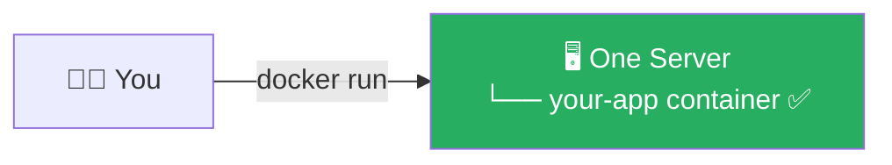

But in the real world, things get complicated fast:

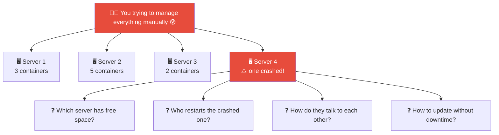

Doing this manually is impossible at scale. That is exactly what Kubernetes solves.

### Without Kubernetes vs With Kubernetes

| Situation | Without Kubernetes | With Kubernetes |
|-----------|-------------------|-----------------|
| App crashes at 3am | You wake up and restart it manually | Kubernetes restarts it automatically in seconds |
| Traffic spikes (10x users) | App slows down or crashes | Kubernetes adds more copies automatically |
| Deploy a new version | Downtime while restarting | Rolling update — zero downtime |
| One server dies | Apps on that server are gone | Kubernetes moves them to healthy servers |
| 50 containers to manage | Spreadsheet + prayers | Kubernetes handles it all |

---

## Kubernetes Architecture

A Kubernetes installation is called a **Cluster**. Every cluster has two parts:

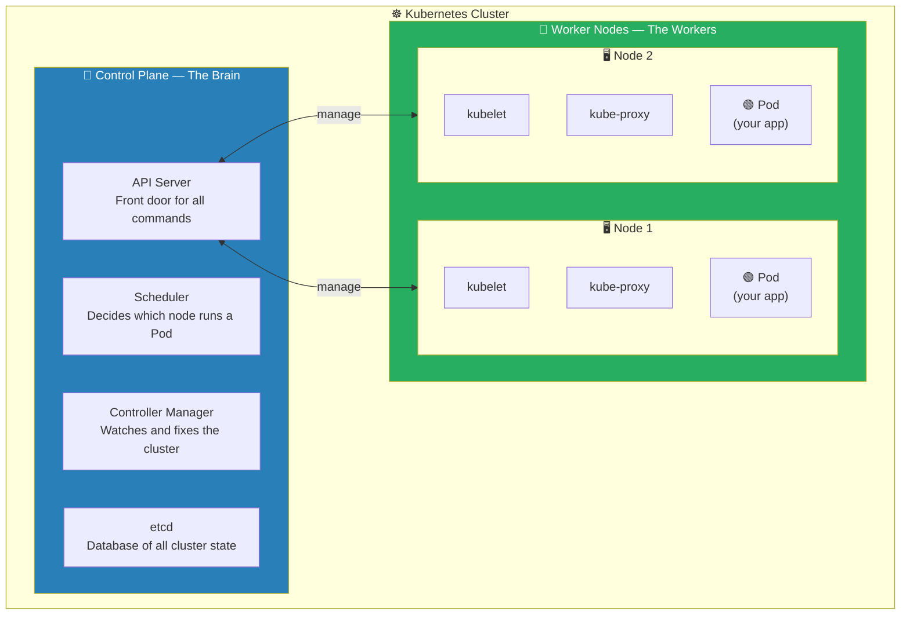

---

## Control Plane — The Brain

The Control Plane makes decisions for the entire cluster. It does not run your apps — it manages everything.

### 1. API Server — The Front Door

Every `kubectl` command goes to the API Server first:

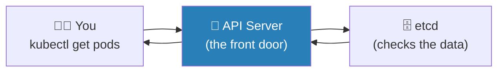

Think of it as the **reception desk** of a company. Everyone must go through it.

### 2. Scheduler — The Task Assigner

Decides **which Worker Node** should run a new Pod:

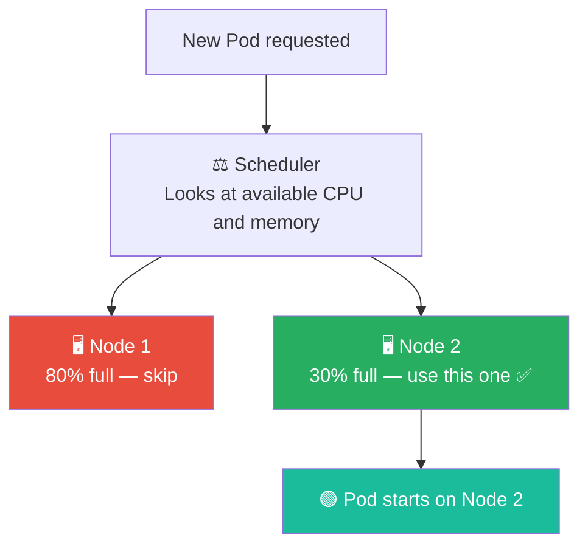

Think of it as the **HR manager** assigning tasks to the right employee.

### 3. Controller Manager — The Quality Inspector

Constantly watches the cluster and makes sure the actual state matches what you asked for:

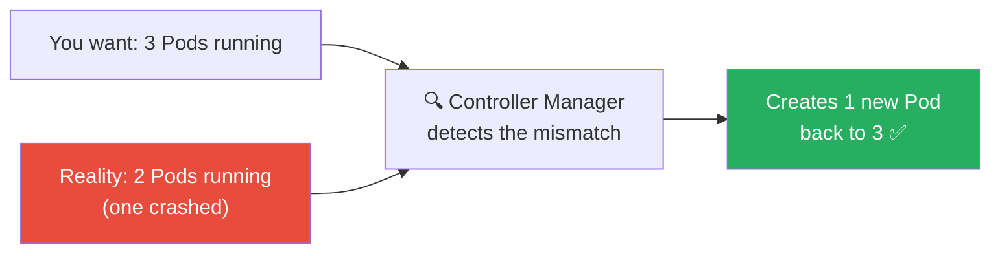

### 4. etcd — The Cluster Memory

A database that stores the **entire state of the cluster**. If etcd is lost, the cluster loses its memory.

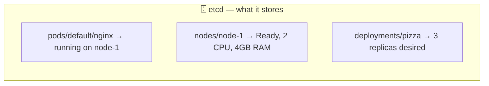

---

## Worker Node — The Workers

Worker Nodes are the machines that **actually run your applications**.

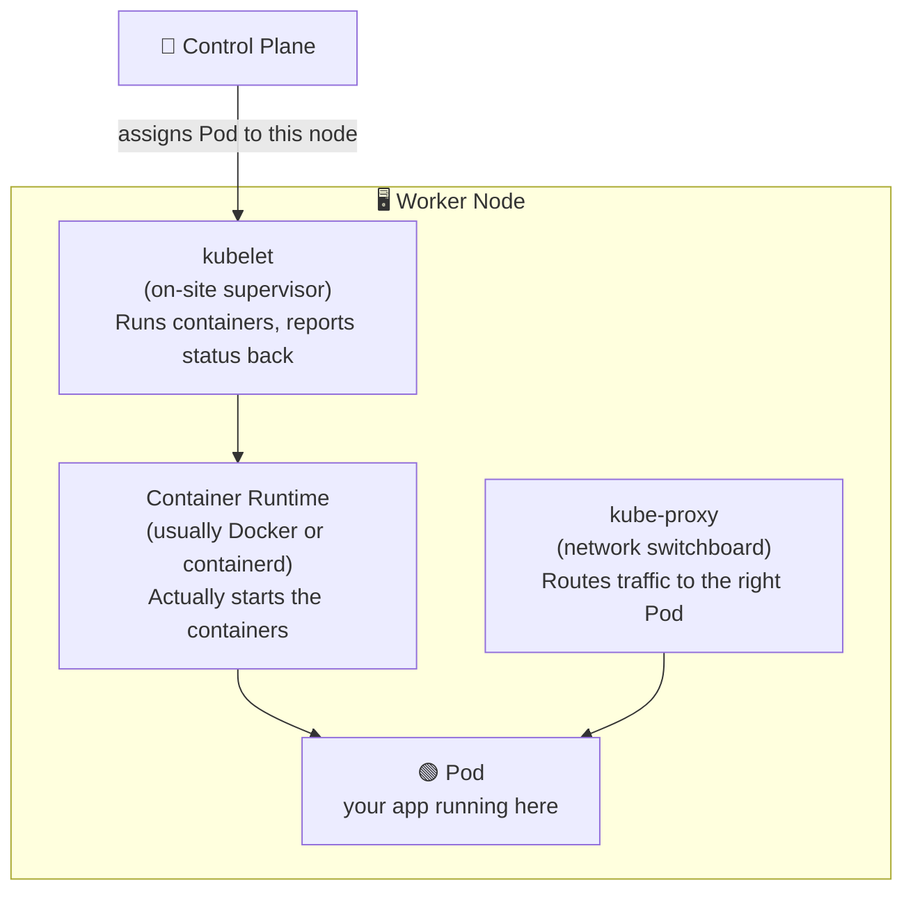

| Component | Simple analogy |
|---|---|
| `kubelet` | On-site supervisor — executes orders and reports back |
| `kube-proxy` | Network switchboard — routes traffic to the right Pod |
| Container Runtime | The engine that actually starts and stops containers |

---

## How Everything Works Together

Here is the full flow from when you type a command to your app running:

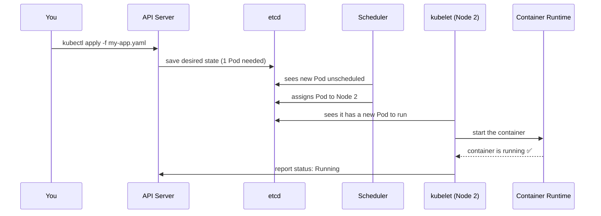

---

## Core Kubernetes Objects (Quick Preview)

These are the building blocks you will use:

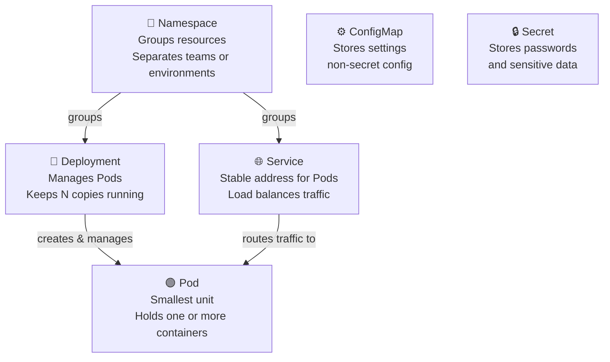

| Object | What it is | Simple analogy |
|--------|-----------|----------------|
| **Pod** | Smallest unit — holds one or more containers | An apartment where containers live |
| **Deployment** | Manages Pods — ensures the right number are always running | A property manager for apartments |
| **Service** | Gives Pods a stable address so others can reach them | A reception desk with a fixed address |
| **Namespace** | A way to group and separate resources in one cluster | Separate floors in a building |
| **ConfigMap** | Stores configuration settings (non-secret) | A settings file |
| **Secret** | Stores sensitive data like passwords | A locked safe |

---

## Kubernetes vs Docker

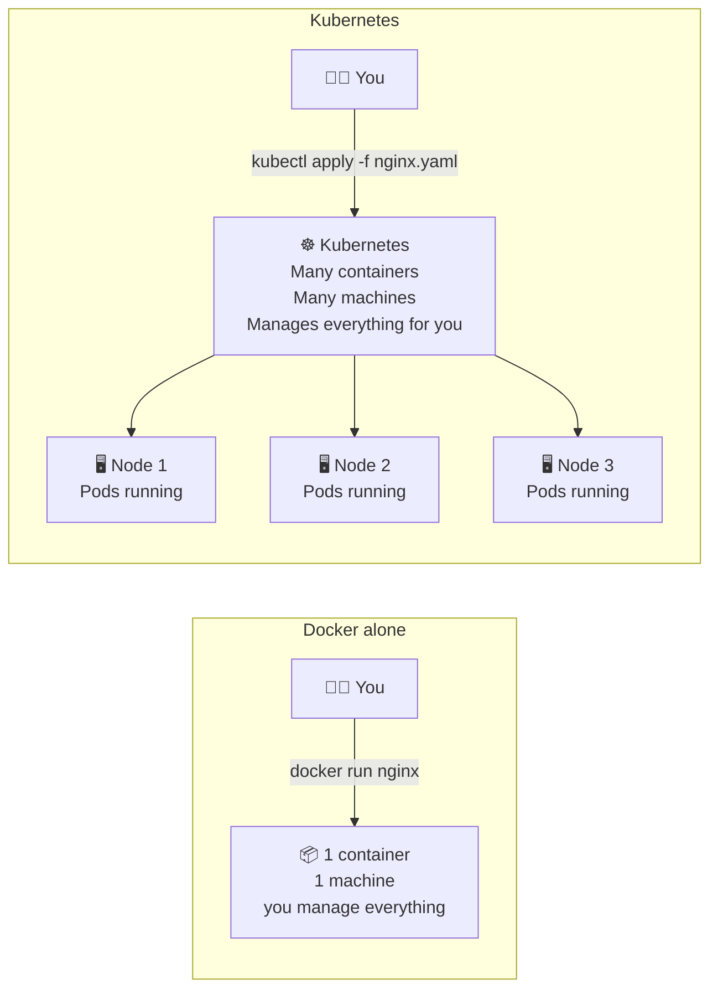

| Feature | Docker Alone | Kubernetes |
|---------|-------------|------------|
| Run containers | ✅ | ✅ |
| Auto-restart crashed containers | ❌ | ✅ |
| Spread across multiple machines | ❌ | ✅ |
| Auto-scale based on load | ❌ | ✅ |
| Rolling updates (zero downtime) | ❌ | ✅ |
| Self-healing | ❌ | ✅ |
| Load balancing | ❌ | ✅ |

**Short answer:** Use Docker to build and run containers. Use Kubernetes to manage containers in production at scale.

---

## Where is Kubernetes Used?

### Managed Kubernetes — Cloud Providers

In real companies, nobody sets up Kubernetes manually. They use managed services where the Control Plane is handled for you:

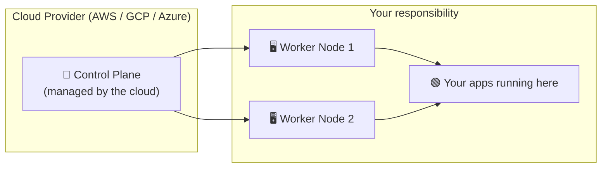

| Cloud | Service Name | Short Name |
|-------|-------------|------------|
| Amazon Web Services | Elastic Kubernetes Service | EKS |
| Google Cloud | Google Kubernetes Engine | GKE |
| Microsoft Azure | Azure Kubernetes Service | AKS |

### On a Local Machine — Minikube

For learning, you use **Minikube** — it runs everything on your laptop inside a single Docker container:

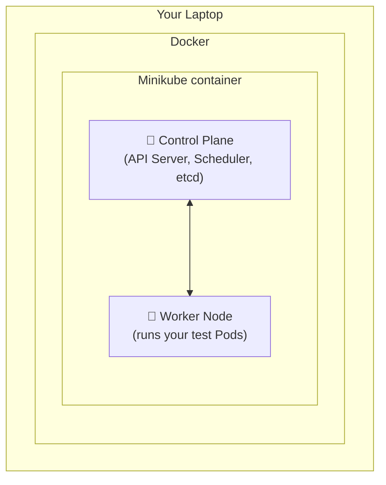

It is perfect for learning all Kubernetes concepts without needing cloud infrastructure.

---

## Summary

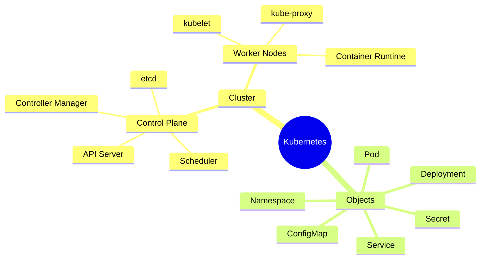

| Concept | One-line explanation |
|---------|---------------------|
| Kubernetes | Automates running, scaling, and healing of containerized apps |
| Cluster | The full Kubernetes setup — all nodes together |
| Control Plane | The brain — makes decisions, stores state |
| Worker Node | The body — actually runs your app containers |
| API Server | Front door for all kubectl commands |
| Scheduler | Picks which node a Pod should run on |
| Controller Manager | Watches and fixes the cluster state |
| etcd | Database holding all cluster state |
| kubelet | Agent on each node that runs containers |
| Pod | Smallest deployable unit — wraps one or more containers |

---

→ Next: [02. how to install kubernetes.md](02.%20how%20to%20install%20kubernetes.md)
