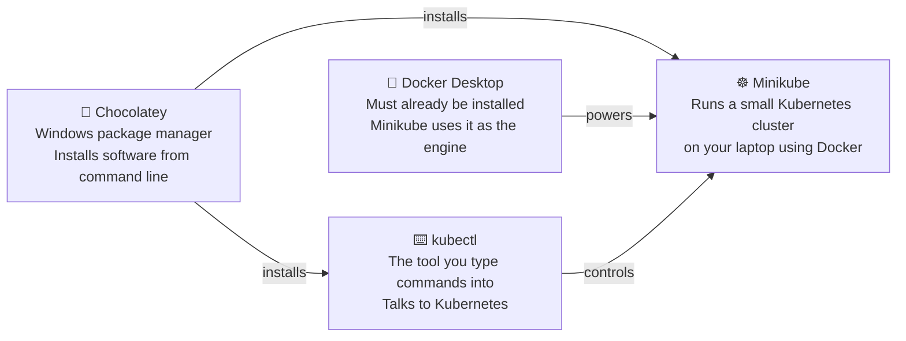
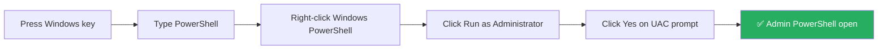
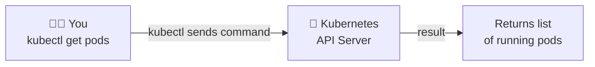
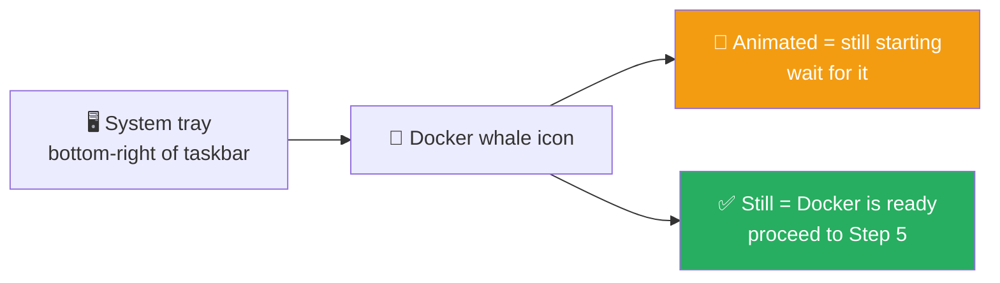
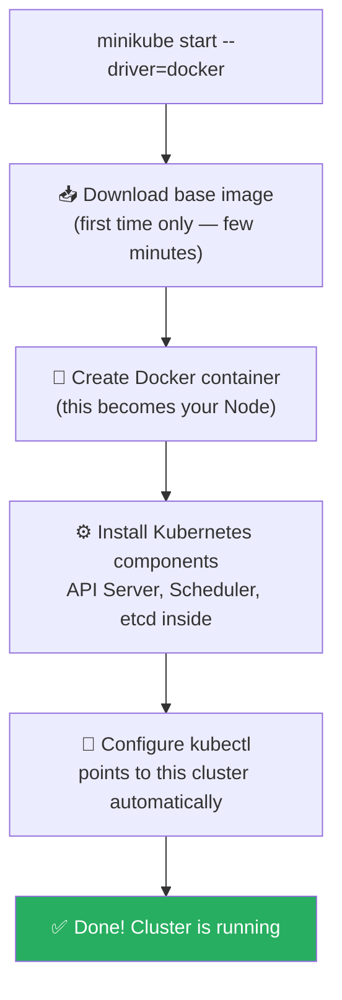
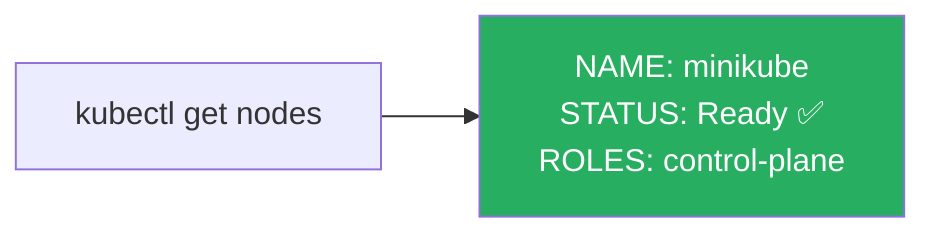
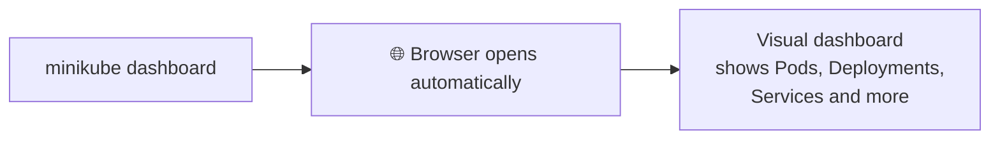
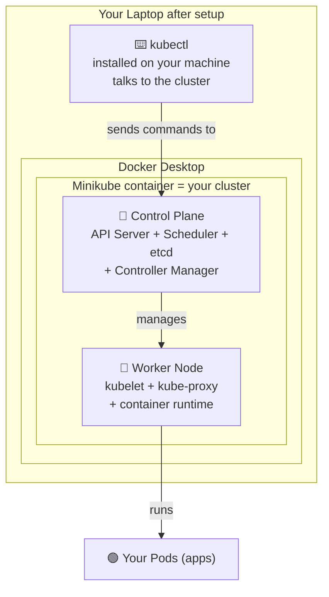
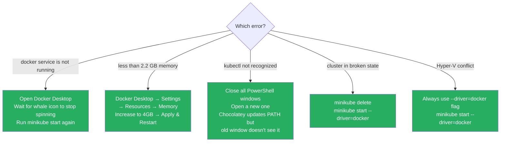
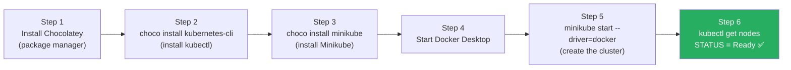

# 02. How to Install Kubernetes on Windows

This guide sets up a local Kubernetes learning environment on **Windows** step by step.

By the end you will have:
- `kubectl` — the command-line tool to control Kubernetes
- `Minikube` — a local single-node Kubernetes cluster running on your machine

---

## What You Need Before Starting

| Requirement | Why |
|-------------|-----|
| Windows 10 or Windows 11 | This guide is Windows-only |
| 4 GB RAM minimum (8 GB recommended) | Minikube needs memory to run the cluster |
| 20 GB free disk space | For Minikube images and container data |
| Internet connection | To download the tools |
| **Docker Desktop** installed and running | Minikube uses Docker as its engine |
| **Chocolatey** (Windows package manager) | Used to install kubectl and Minikube |

> If you do not have Docker Desktop, download it from [docker.com/products/docker-desktop](https://www.docker.com/products/docker-desktop/). Install it and make sure it is **running** before continuing.

---

## What We Are Installing and Why



---

## Step 1 — Install Chocolatey

Chocolatey is a package manager for Windows — it lets you install software from the command line, similar to `apt` on Ubuntu or `brew` on Mac.

**Official Chocolatey documentation:** [https://docs.chocolatey.org/en-us/choco/setup/](https://docs.chocolatey.org/en-us/choco/setup/)

### How to open PowerShell as Administrator



### Install command

Paste this into the Administrator PowerShell and press Enter:

```powershell
Set-ExecutionPolicy Bypass -Scope Process -Force; `
[System.Net.ServicePointManager]::SecurityProtocol = `
[System.Net.ServicePointManager]::SecurityProtocol -bor 3072; `
iex ((New-Object System.Net.WebClient).DownloadString('https://community.chocolatey.org/install.ps1'))
```

### What this command does (line by line)

| Line | What it does |
|------|-------------|
| `Set-ExecutionPolicy Bypass` | Temporarily allows running scripts (only for this session) |
| `SecurityProtocol -bor 3072` | Forces the use of TLS 1.2 so the download is secure |
| `iex (... DownloadString(...))` | Downloads and runs the Chocolatey install script |

### Verify Chocolatey installed

```powershell
choco --version
```

Expected output:
```
Chocolatey v2.x.x
```

---

## Step 2 — Install kubectl

`kubectl` is the command-line tool you use to talk to Kubernetes. Every command you run to manage your cluster goes through `kubectl`.



### Install command

```powershell
choco install kubernetes-cli -y
```

The `-y` flag means "yes to all prompts" so it installs without asking for confirmation.

### Verify kubectl installed

Close PowerShell and open a **new** PowerShell window (not as admin), then run:

```powershell
kubectl version --client
```

Expected output:
```
Client Version: v1.xx.x
Kustomize Version: v5.x.x
```

> The "Server Version" line may show an error at this point — that is normal because we have not started a cluster yet.

---

## Step 3 — Install Minikube

Minikube creates a small Kubernetes cluster on your local machine using Docker.

### Install command

```powershell
choco install minikube -y
```

### Verify Minikube installed

```powershell
minikube version
```

Expected output:
```
minikube version: v1.xx.x
commit: xxxxxxxxxx
```

---

## Step 4 — Check Docker Desktop is Running

Before starting Minikube, Docker Desktop **must be running**.



---

## Step 5 — Start Your Kubernetes Cluster

Now start Minikube with Docker as the driver:

```powershell
minikube start --driver=docker
```

### What happens when you run this



### Full expected output (first time)

```
😄  minikube v1.xx.x on Windows 11
✨  Using the docker driver based on user configuration
📌  Using Docker Desktop driver with root privileges
👍  Starting "minikube" primary control-plane node in "minikube" cluster
🚜  Pulling base image v0.0.xx ...
💾  Downloading Kubernetes v1.xx.x preload ...
🔥  Creating docker container (CPUs=2, Memory=2200MB) ...
🐳  Preparing Kubernetes v1.xx.x on Docker xx.x.x ...
🔎  Verifying Kubernetes components...
🌟  Enabled addons: storage-provisioner, default-storageclass
🏄  Done! kubectl is now configured to use "minikube" cluster
```

> The first start takes 3–10 minutes because it needs to download images. Future starts are much faster.

---

## Step 6 — Verify the Cluster is Working

### Check cluster info

```powershell
kubectl cluster-info
```

Expected output:
```
Kubernetes control plane is running at https://127.0.0.1:XXXXX
CoreDNS is running at https://127.0.0.1:XXXXX/api/v1/...
```

### Check the nodes

```powershell
kubectl get nodes
```

Expected output:
```
NAME       STATUS   ROLES           AGE   VERSION
minikube   Ready    control-plane   1m    v1.xx.x
```



The word `Ready` confirms your cluster node is healthy and running. You are all set.

---

## Step 7 — Open the Kubernetes Dashboard (Optional)

Minikube comes with a visual web dashboard:

```powershell
minikube dashboard
```



To stop the dashboard, press `Ctrl + C` in PowerShell.

---

## What You Just Built



---

## Useful Commands to Know

### Minikube commands

| Command | What it does |
|---------|-------------|
| `minikube start` | Start the cluster |
| `minikube stop` | Stop the cluster (saves your work, can restart later) |
| `minikube delete` | Delete the cluster completely (clean slate) |
| `minikube status` | Show whether the cluster is running or stopped |
| `minikube dashboard` | Open the web UI in your browser |
| `minikube pause` | Pause the cluster (frees CPU without deleting) |
| `minikube unpause` | Resume a paused cluster |

### kubectl commands (basic)

| Command | What it does |
|---------|-------------|
| `kubectl get nodes` | List all nodes in the cluster |
| `kubectl get pods` | List all running Pods |
| `kubectl get all` | Show everything in the default namespace |
| `kubectl cluster-info` | Show cluster connection info |

---

## Common Problems & Fixes



---

## Quick Recap



---

→ Next: [03. Core Concept k8s.md](03.%20Core%20Concept%20k8s.md)
