# 03. Core Concepts & First Commands

> **Series:** Overview → Install → **Core Concepts** → Deployments & ReplicaSets → Services → …

This document covers the three most important Kubernetes objects you will use every day — **Pod**, **Deployment**, and **Service** — and the commands to work with them.

---

## The Three Core Objects

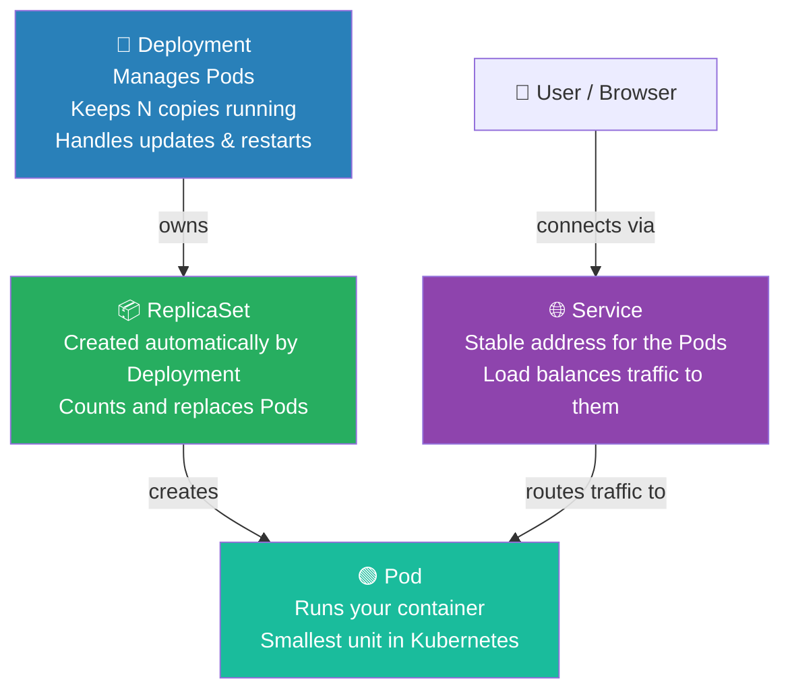

---

## 1. Pod — The Running Application

A Pod is the smallest deployable unit in Kubernetes. It contains one or more containers.

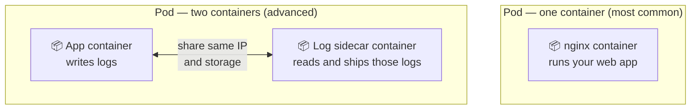

Create a Pod directly (quick test):

```bash
kubectl run nginx --image=nginx
```

Check it:

```bash
kubectl get pods
```

Example output:

```
NAME                      READY   STATUS    RESTARTS   AGE
nginx                     1/1     Running   0          10s
```

> **Problem with bare Pods:** If the Pod crashes, Kubernetes does **not** restart it. That is why you use a Deployment.

---

## 2. Deployment — The Pod Manager

A Deployment manages Pods and makes sure the desired number are always running.

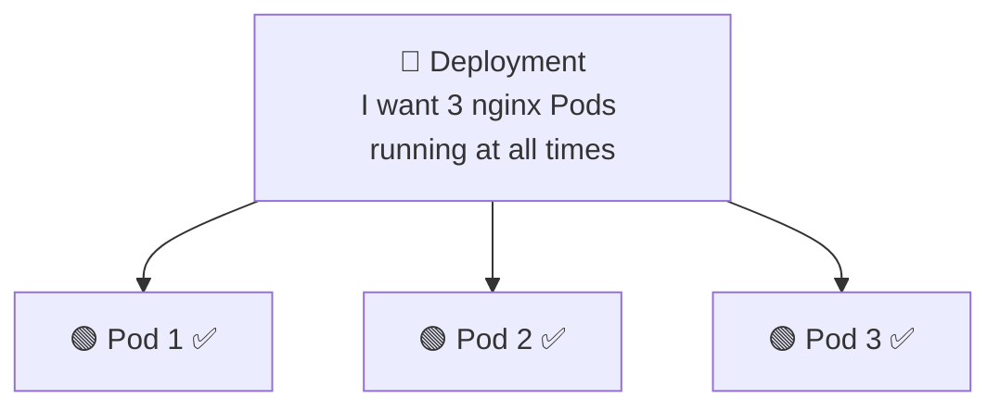

If one Pod crashes, the Deployment creates a replacement automatically:

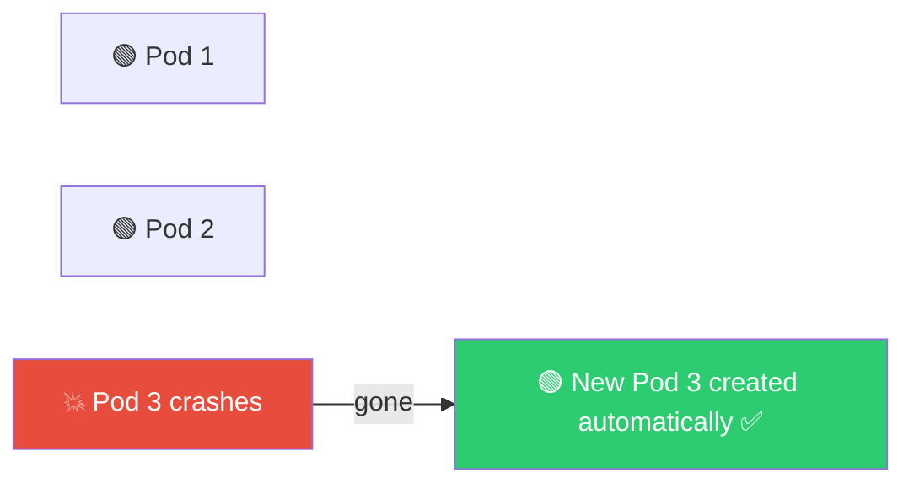

Create a Deployment:

```bash
kubectl create deployment hello-k8s --image=nginx
```

Scale it up to 3 Pods:

```bash
kubectl scale deployment hello-k8s --replicas=3
```

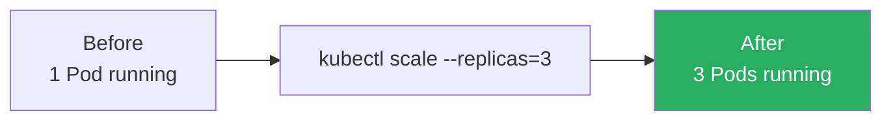

**Benefits of Deployments:**
- Self-healing — replaces crashed Pods automatically
- Scaling — add or remove Pods with one command
- Rolling updates — update the image without downtime
- Rollbacks — go back to a previous version if something breaks

---

## 3. Service — Network Access to Pods

Pods get a random IP address that changes every time the Pod is replaced. A **Service** gives them a stable address that never changes.

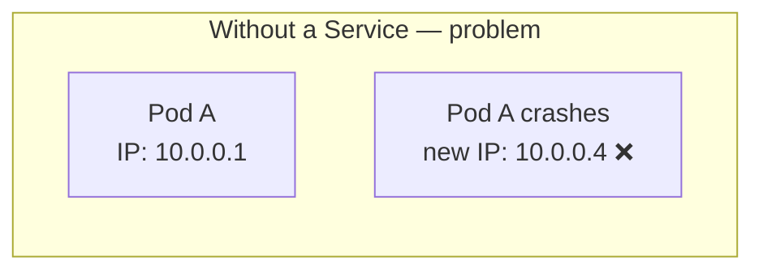

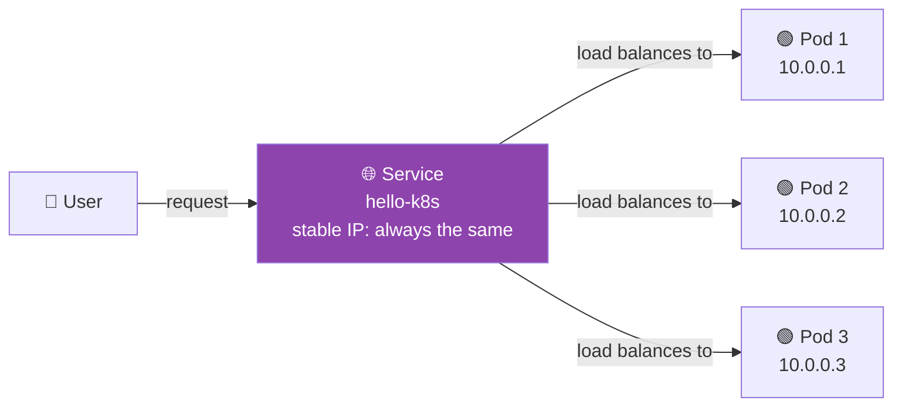

Traffic is automatically load balanced:
```
Request 1 → Pod 1
Request 2 → Pod 2
Request 3 → Pod 3
Request 4 → Pod 1  (cycles back)
```

Expose the Deployment as a Service:

```bash
kubectl expose deployment hello-k8s --type=NodePort --port=80
```

Open it in your browser via Minikube:

```bash
minikube service hello-k8s
```

---

## The Full Flow

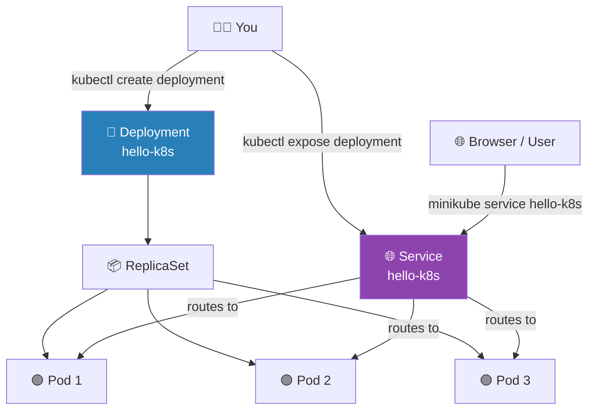

Your commands create this chain:

```bash
kubectl create deployment hello-k8s --image=nginx
# Creates: Deployment → ReplicaSet → Pod

kubectl expose deployment hello-k8s --type=NodePort --port=80
# Creates: Service → points at the Pods
```

---

## Commands Reference

### Listing resources

```bash
kubectl get pods           # list all Pods
kubectl get deployments    # list all Deployments
kubectl get svc            # list all Services
kubectl get all            # show everything at once
```

```bash
kubectl get pods -w        # watch pods — updates live in the terminal
```

### Checking a Service URL

```bash
minikube service hello-k8s        # opens in browser directly
minikube service hello-k8s --url  # prints the URL instead of opening browser
```

### Scaling

```bash
kubectl scale deployment hello-k8s --replicas=5   # scale up to 5
kubectl scale deployment hello-k8s --replicas=2   # scale down to 2
```

---

## Deleting Resources

### Delete a Service

```bash
kubectl delete svc hello-k8s
# or
kubectl delete service hello-k8s
```

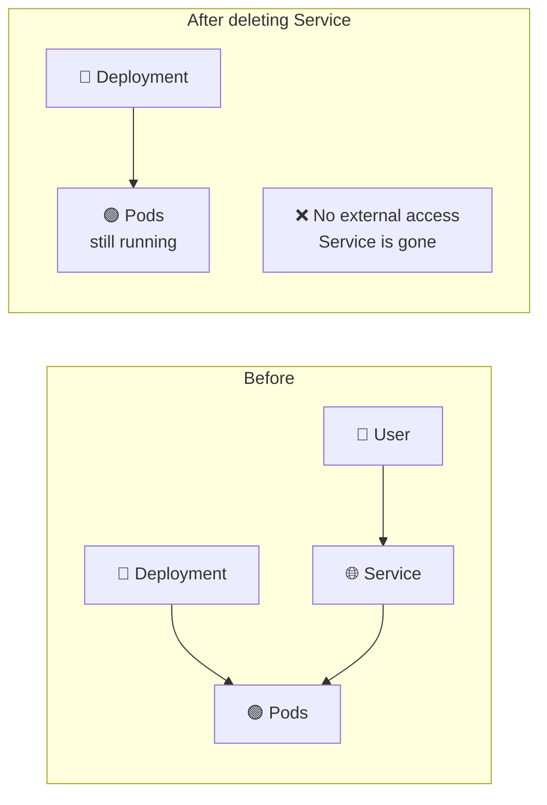

Deleting a Service only removes network access. The Deployment and Pods **keep running**.

---

### Delete a Deployment

```bash
kubectl delete deployment hello-k8s
```

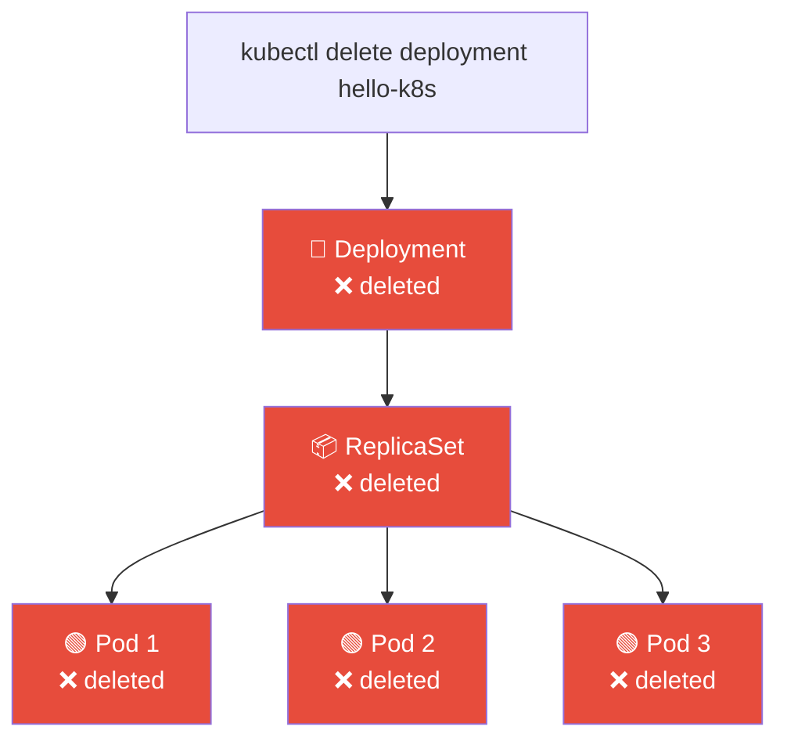

Deleting a Deployment removes **everything it owns** — the ReplicaSet and all Pods.

---

## Pod vs Container — Point of Confusion

Many people assume **Pod = Container**, but they are not the same thing.

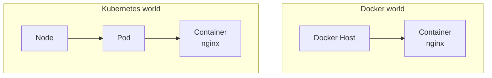

> Kubernetes adds an extra layer. The container lives **inside** the Pod.

In 90% of cases a Pod has just one container — so people casually say *"my Pod is running"* even though the container is what is actually doing the work.

### Why did Kubernetes create Pods?

Because sometimes two containers need to work very closely together:

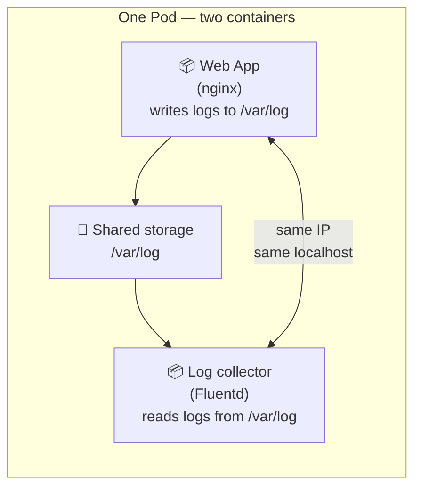

Both containers share the same IP address, same storage, and start/stop together. Kubernetes treats them as one unit.

---

## Real-World Analogy

| Kubernetes | Restaurant analogy |
|---|---|
| Pod | A chef — does the actual cooking |
| Deployment | The restaurant manager — ensures 3 chefs are always on shift |
| Service | The front desk — takes orders and sends them to an available chef |
| ReplicaSet | The shift tracker — counts chefs and calls in a replacement if one leaves |

---

## Quick Reference

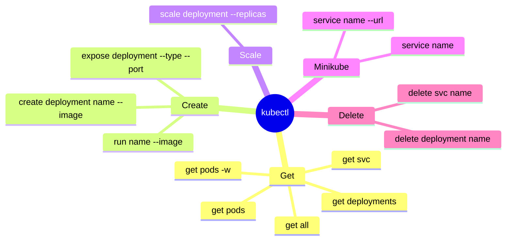

---

→ Next: [04. Deployments_Pods_ReplicaSets.md](04.%20Deployments_Pods_ReplicaSets.md)
