# 04. Pods, Deployments & ReplicaSets

> **Series:** Overview → Install → Core Concepts → **Pods & Deployments** → Services → …

In doc 03 you created your first Deployment with one command and scaled it. This document explains **what is actually happening** behind those commands — what a Pod looks like, what a ReplicaSet is, how labels connect everything, and how scaling works.

---

## 1. The Full Picture

When you run `kubectl create deployment`, Kubernetes creates three things:

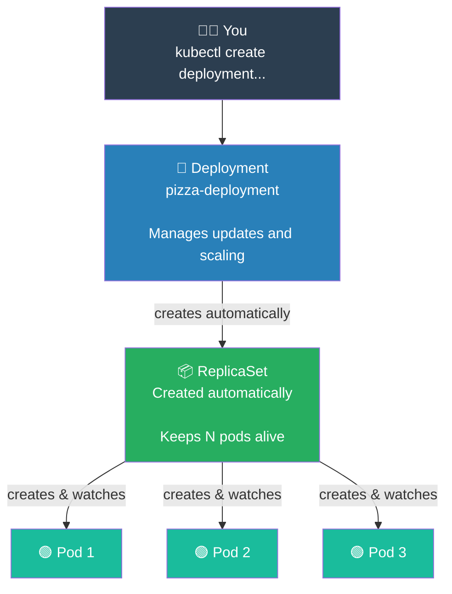

You only think about the Deployment. Kubernetes creates the ReplicaSet and Pods automatically.

---

## 2. What is a Pod — Reading the YAML

A Pod is the smallest unit Kubernetes manages. Here is the YAML you ran:

```yaml
apiVersion: v1          # tells Kubernetes which API to use — v1 for basic objects like Pod
kind: Pod               # the type of object you are creating
metadata:
  name: pizza-pod       # the name of this Pod — used in every kubectl command
  labels:
    app: pizza          # a tag — used to filter and find this pod later
    department: pizza   # another tag — you can add as many as you want
spec:
  containers:
  - name: chef          # name of the container inside the Pod
    image: nginx:latest # the Docker image to run
    ports:
    - containerPort: 80 # the port the app listens on inside the container
```

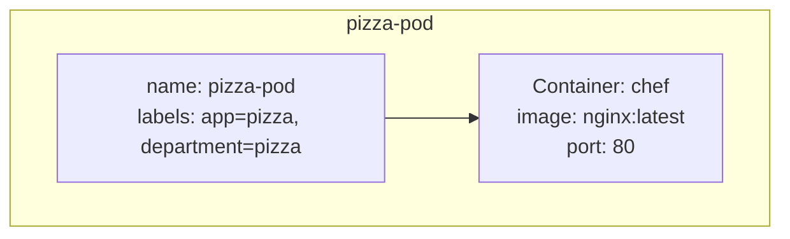

**Important:** A bare Pod (created directly like this) is **never restarted** by Kubernetes if it crashes. It simply disappears. That is why you use a Deployment instead.

---

## 3. What is a ReplicaSet?

When you saw `kubectl delete deployment hello-k8s` in doc 03, the output said it also deleted a ReplicaSet. Here is what that ReplicaSet was doing:

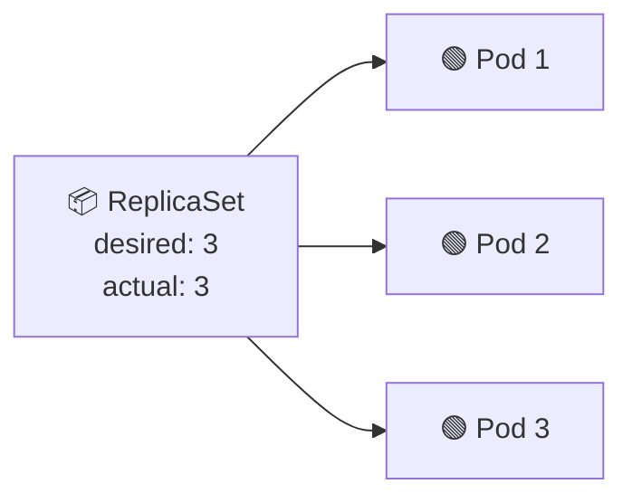

The ReplicaSet runs a constant loop:

> "How many Pods do I have right now? Is it equal to the desired number? If not — fix it."

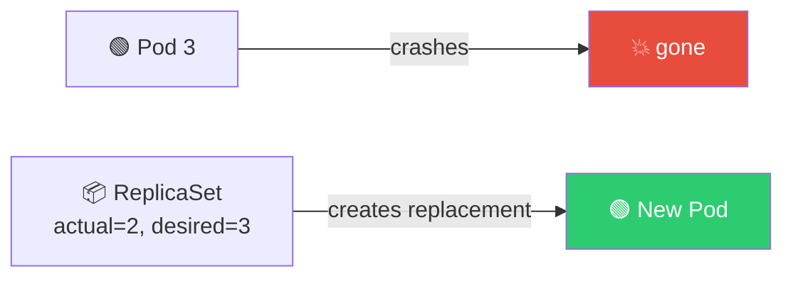

You never create a ReplicaSet directly — the Deployment creates and manages it for you.

---

## 4. Labels and Selectors

Labels are simple `key: value` tags you put on Pods. A selector says: *"find me everything with this label"*.

This is how the Deployment knows which Pods belong to it:

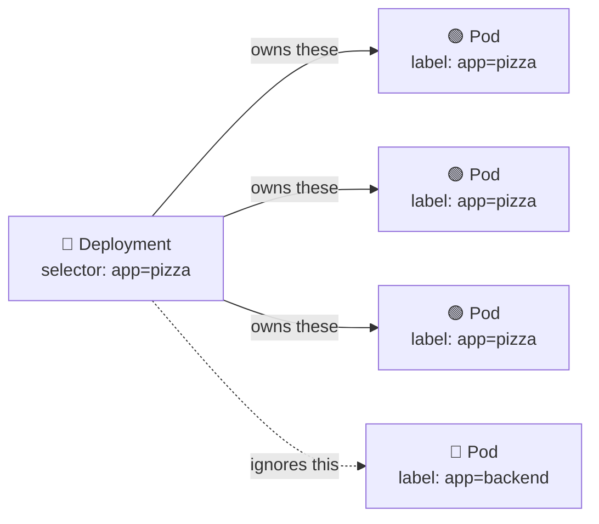

In your YAML, the selector and the Pod labels **must match exactly**:

```yaml
spec:
  selector:
    matchLabels:
      app: pizza        # Deployment looks for Pods with this label

  template:
    metadata:
      labels:
        app: pizza      # every Pod gets this label — must be the same as above
        department: pizza
```

---

## 5. Commands You Ran — Explained

### `kubectl apply -f`

Reads your YAML file and creates (or updates) the objects described in it.

```bash
kubectl apply -f "../kubernetes Projects/04. Deployments_Pods_ReplicaSets.yaml"
```

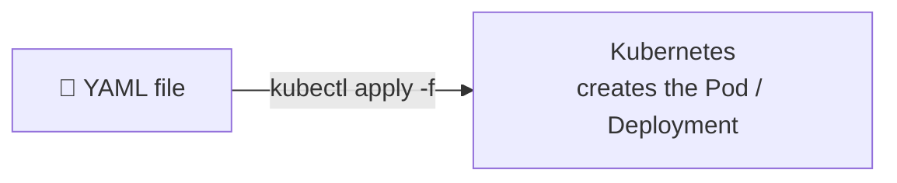

---

### `kubectl get pods`

Lists all Pods and their current status.

```bash
kubectl get pods
```

```
NAME                                READY   STATUS    RESTARTS   AGE
pizza-pod                           1/1     Running   0          10s
pizza-deployment-7fd8b6-abcde       1/1     Running   0          5s
pizza-deployment-7fd8b6-xyz12       1/1     Running   0          5s
pizza-deployment-7fd8b6-qwer3       1/1     Running   0          5s
```

| Column | Meaning |
|---|---|
| `READY` | containers ready / total containers in the Pod |
| `STATUS` | current state: Running, Pending, CrashLoopBackOff… |
| `RESTARTS` | how many times the container has been restarted |
| `AGE` | how long this Pod has been running |

---

### `kubectl describe pod pizza-pod`

Shows the full detail of a Pod — labels, image, events, IP address, and what happened recently.

```bash
kubectl describe pod pizza-pod
```

The most useful part is at the very bottom — the **Events** section:

```
Events:
  Normal   Pulling  10s   kubelet  Pulling image "nginx:latest"
  Normal   Pulled   8s    kubelet  Successfully pulled image
  Normal   Started  8s    kubelet  Started container chef
```

If something goes wrong, Events tells you exactly what failed.

---

### `kubectl logs pizza-pod`

Shows everything the container has printed to the screen (stdout).

```bash
kubectl logs pizza-pod
```

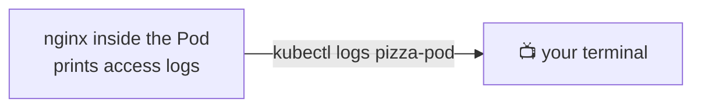

Useful for seeing errors if your app is not working correctly.

---

### `kubectl delete pod pizza-pod`

Deletes the Pod. Because this is a bare Pod (not managed by a Deployment), it is **gone permanently**.

```bash
kubectl delete pod pizza-pod
kubectl get pods    # pod is gone — nothing recreates it
```

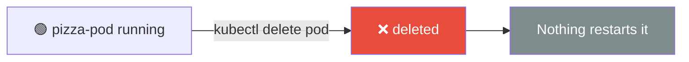

---

### `kubectl create deployment`

Creates a Deployment imperatively — no YAML needed. Kubernetes creates the Deployment, ReplicaSet, and Pods automatically.

```bash
kubectl create deployment pizza-deployment --image=nginx:latest
```

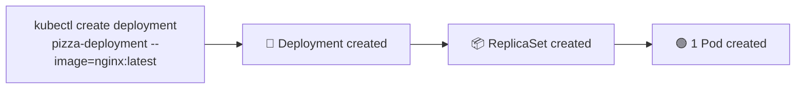

---

### `kubectl get deployments`

Lists all Deployments in the current namespace.

```bash
kubectl get deployments
```

```
NAME                READY   UP-TO-DATE   AVAILABLE   AGE
pizza-deployment    3/3     3            3           1m
```

| Column | Meaning |
|---|---|
| `READY` | how many Pods are ready / desired |
| `UP-TO-DATE` | Pods running the latest image version |
| `AVAILABLE` | Pods currently accepting traffic |

---

### `kubectl scale deployment`

Changes how many Pods the Deployment keeps running.

```bash
kubectl scale deployment pizza-deployment --replicas=3
kubectl get pods    # 3 pods now running

kubectl scale deployment pizza-deployment --replicas=2
kubectl get pods    # 2 pods now — one was removed
```

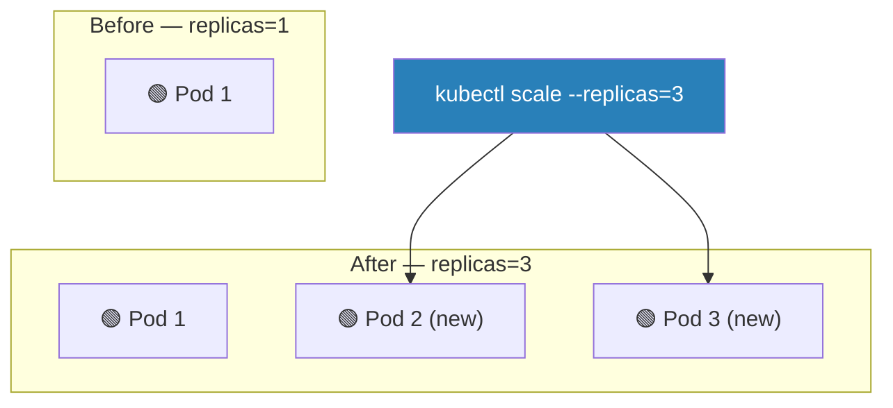

Kubernetes adds new Pods or removes extras to match the number you asked for.

---

### `kubectl get pods -l` and `--selector`

Both commands filter Pods by label. They do the same thing — just different ways to write it.

```bash
kubectl get pods -l app=pizza
kubectl get pods --selector=app=pizza          # same result

kubectl get pods --selector=department=pizza   # filter by department label
```

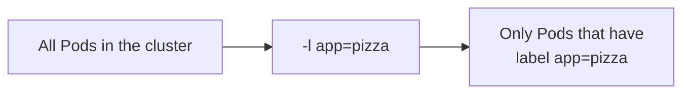

This is very useful when you have many Pods from different apps — you can quickly see only the ones you care about.

---

### `kubectl delete deployment`

Deletes the Deployment **and** everything it owns (ReplicaSet + all Pods).

```bash
kubectl delete deployment pizza-deployment
kubectl get pods    # all pods from this deployment are gone
```

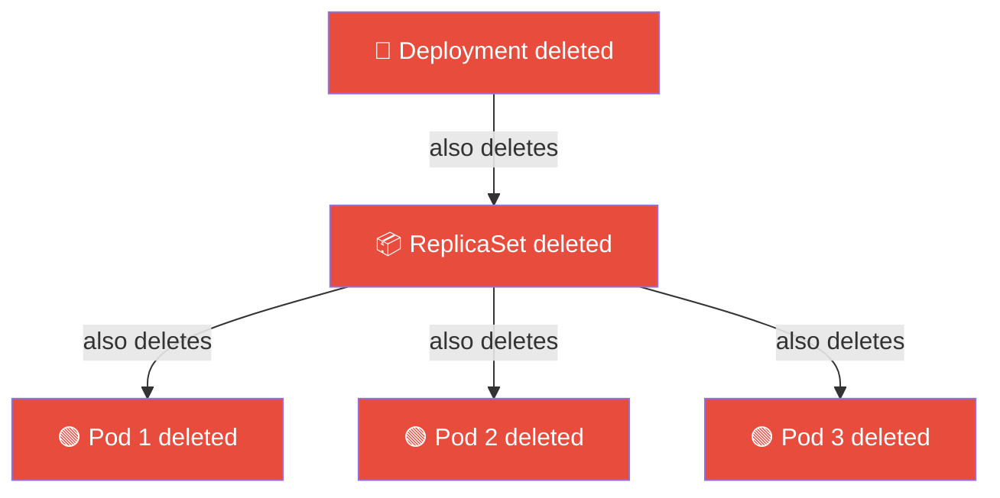

This is different from deleting a single Pod. When you delete a Pod that is owned by a Deployment, the Deployment creates a new one. When you delete the **Deployment itself**, everything is removed and nothing is recreated.

---

## 6. Bare Pod vs Deployment — The Key Difference

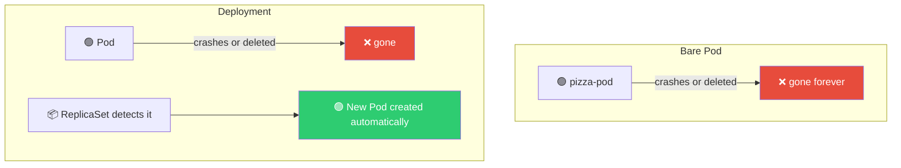

| | Bare Pod | Deployment |
|---|---|---|
| Self-healing (auto restart) | ❌ No | ✅ Yes |
| Scaling | ❌ No | ✅ Yes |
| Use in production | Never | Always |

---

## 7. All Commands from This Document

```bash
# Create from YAML file (run from the kubernetes Guide/ folder)
kubectl apply -f "../kubernetes Projects/04. Deployments_Pods_ReplicaSets.yaml"

# Or run from the repo root folder
kubectl apply -f "kubernetes Projects/04. Deployments_Pods_ReplicaSets.yaml"

# Delete using the same path
kubectl delete -f "kubernetes Projects/04. Deployments_Pods_ReplicaSets.yaml"

# List pods
kubectl get pods

# Full details of a pod (labels, image, events)
kubectl describe pod pizza-pod

# View what the container is printing
kubectl logs pizza-pod

# Delete a single pod
kubectl delete pod pizza-pod

# Create a deployment without YAML (imperative)
kubectl create deployment pizza-deployment --image=nginx:latest

# List deployments
kubectl get deployments

# Filter pods by label (both do the same thing)
kubectl get pods -l app=pizza
kubectl get pods --selector=department=pizza

# Scale up or down
kubectl scale deployment pizza-deployment --replicas=3
kubectl scale deployment pizza-deployment --replicas=2

# Delete the entire deployment (removes all its pods too)
kubectl delete deployment pizza-deployment
```

---

## Summary

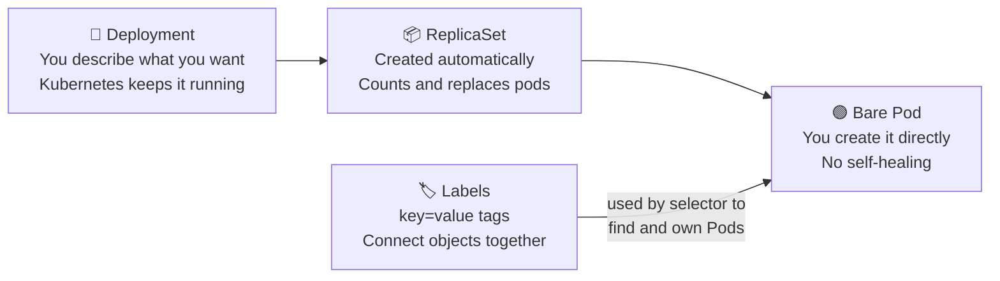

| What you learned | One-line summary |
|---|---|
| **Pod** | The smallest unit — runs your container |
| **ReplicaSet** | Keeps exactly N Pods running — created by the Deployment |
| **Deployment** | The right way to run apps — manages the ReplicaSet for you |
| **Labels** | `key: value` tags on Pods — selectors use them to find Pods |
| **`kubectl apply -f`** | Create or update objects from a YAML file |
| **`kubectl describe`** | Full details + Events — best tool for debugging |
| **`kubectl logs`** | See what your container is printing |
| **`kubectl scale`** | Change how many Pods are running |
| **`-l` / `--selector`** | Filter Pods by their label |
