# 05. Services — NodePort, ClusterIP & LoadBalancer

> **Series:** Overview → Install → Core Concepts → Deployments & ReplicaSets → **Services** → …

In doc 04 you learned that Pods come and go — they get replaced, and each replacement gets a new IP address. A **Service** solves the problem of reaching Pods reliably even as they are created and destroyed.

In this document you will understand the three Service types using the exact files you created and ran.

---

## 1. Why Do We Need a Service?

Every Pod gets its own IP address. But when a Pod crashes and a new one starts, the IP changes:

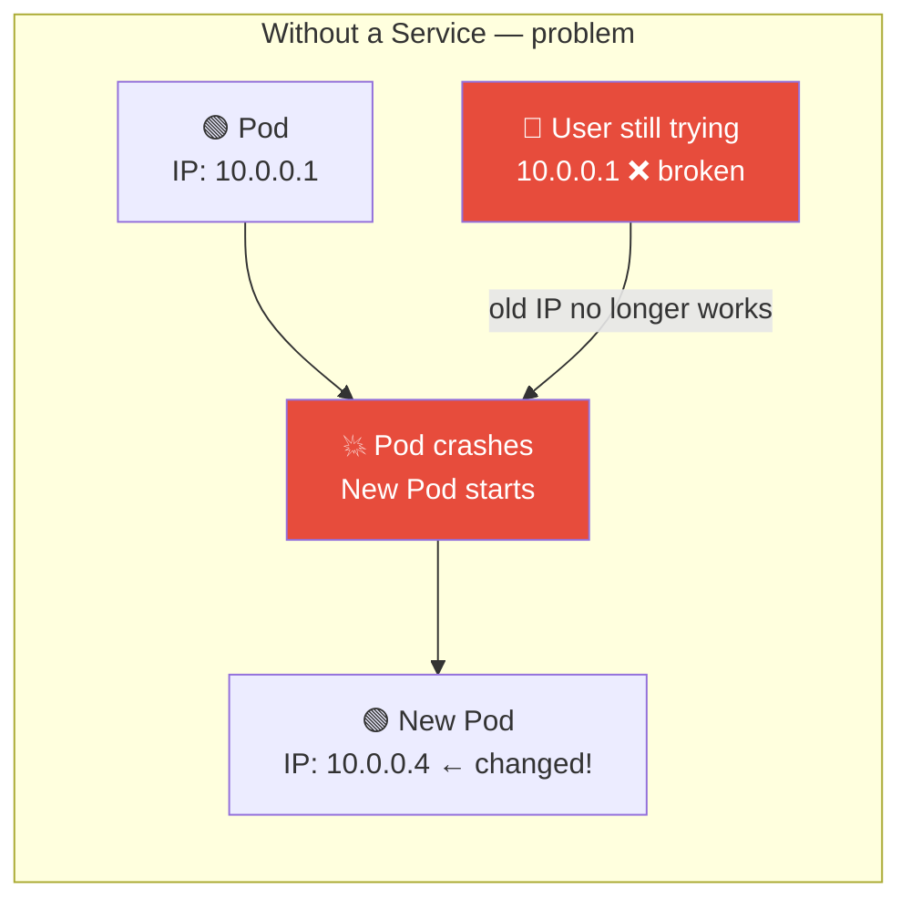

A **Service** gives you a **stable address** that never changes, no matter how many times the Pods behind it are replaced:

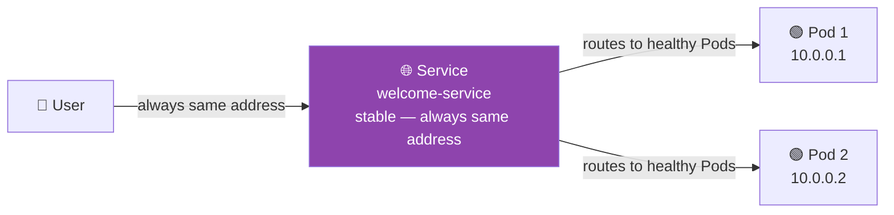

---

## 2. How a Service Finds Its Pods — Selector

Just like a Deployment uses labels to own its Pods, a Service uses a **selector** to find the Pods it should send traffic to.

In your files, the Deployment stamps every Pod with `app: welcome`:

```yaml
# deployment.yaml — the Pod template
template:
  metadata:
    labels:
      app: welcome      # every Pod gets this label
```

And the Service uses the same label to find them:

```yaml
# service-nodeport.yaml
spec:
  selector:
    app: welcome        # find Pods with this label and send traffic to them
```

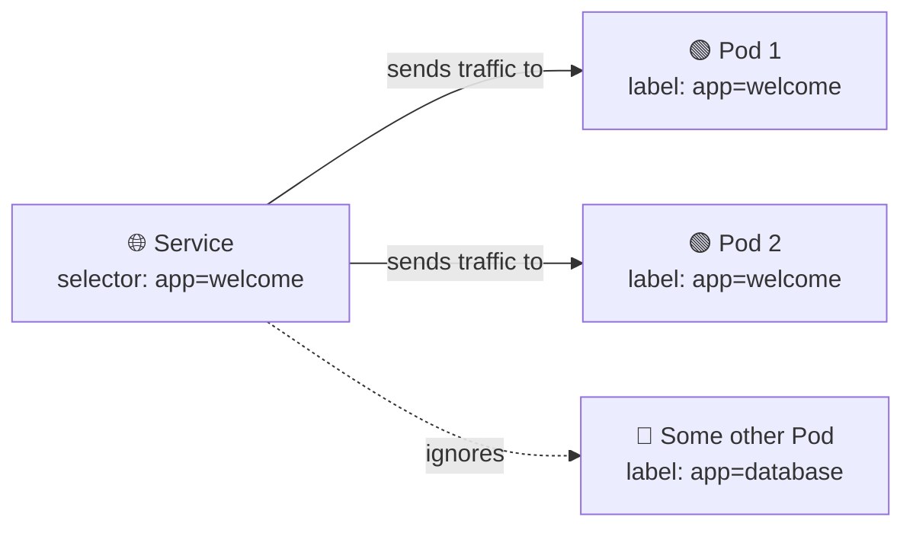

---

## 3. The Three Service Types

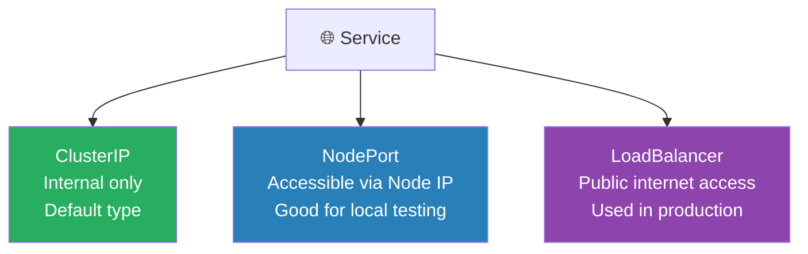

---

## 4. NodePort — Access via Node IP and Port

NodePort opens a port on the node itself so you can reach the Service from outside the cluster using:

```
Node IP : NodePort number
```

### Your service-nodeport.yaml explained

```yaml
apiVersion: v1
kind: Service
metadata:
  name: welcome-service
spec:
  type: NodePort           # expose via node IP + port
  selector:
    app: welcome           # send traffic to Pods with this label
  ports:
    - protocol: TCP
      port: 8080           # the port the Service listens on inside the cluster
      targetPort: 8080     # the port the container is listening on (inside the Pod)
      nodePort: 30080      # the port opened on the Node (must be 30000–32767)
```

### The three ports explained

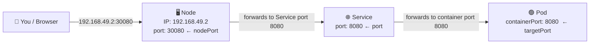

| Field | What it means |
|---|---|
| `nodePort: 30080` | The port opened on the Node — this is what you type in the browser |
| `port: 8080` | The port the Service itself listens on inside the cluster |
| `targetPort: 8080` | The port your container is actually listening on |

### Commands you ran

```bash
# Apply the deployment first (Pods must exist before the Service routes to them)
kubectl apply -f deployment.yaml

# Apply the NodePort Service
kubectl apply -f service-nodeport.yaml

# List Services — see the NodePort and the assigned port
kubectl get svc
```

Expected output:

```
NAME              TYPE       CLUSTER-IP      PORT(S)          AGE
welcome-service   NodePort   10.96.85.123    8080:30080/TCP   10s
```

The `8080:30080` means: Service port 8080 → Node port 30080.

```bash
# Open the app in the browser (Minikube finds the correct node IP for you)
minikube service welcome-service
```

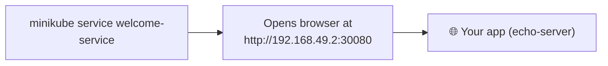

---

## 5. LoadBalancer — Public Internet Access

A LoadBalancer Service requests a public IP from the cloud provider (AWS, GCP, Azure). Anyone on the internet can then reach your app.

### Your service-loadbalancer.yaml explained

```yaml
apiVersion: v1
kind: Service
metadata:
  name: welcome-lb
spec:
  type: LoadBalancer       # ask cloud for a public IP
  selector:
    app: welcome           # same — routes to Pods with this label
  ports:
    - port: 80             # users hit port 80 (standard web port)
      targetPort: 8080     # container (kicbase/echo-server) is listening on 8080 inside the Pod
```

### How LoadBalancer traffic flows

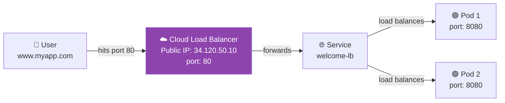

```bash
kubectl apply -f service-loadbalancer.yaml

# Watch until the EXTERNAL-IP is assigned (on cloud — takes ~1 minute)
kubectl get svc -w
```

```
NAME          TYPE           CLUSTER-IP     EXTERNAL-IP     PORT(S)   AGE
welcome-lb    LoadBalancer   10.96.20.100   34.120.50.10    80/TCP    45s
```

> **On Minikube:** EXTERNAL-IP shows `<pending>` forever because there is no real cloud provider. Use `minikube tunnel` in a separate terminal to simulate one, or just use NodePort for local testing.

---

## 6. ClusterIP — Internal Only (Default)

ClusterIP is the default Service type. It gives the Service a stable IP address that is only reachable **from inside the cluster** — not from the internet.

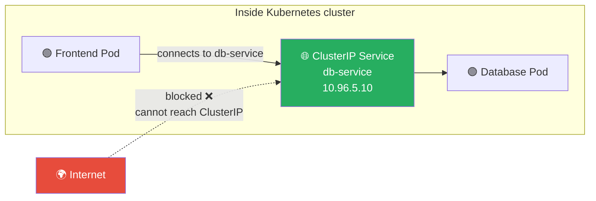

You do not need to write `type: ClusterIP` — it is the default when you leave `type` out:

```yaml
spec:
  # type: ClusterIP  ← this is the default, no need to write it
  selector:
    app: database
  ports:
    - port: 5432
      targetPort: 5432
```

**Use ClusterIP when:** the Pod should only be reachable by other Pods inside the cluster (databases, internal APIs).

---

## 7. All Three Types Side by Side

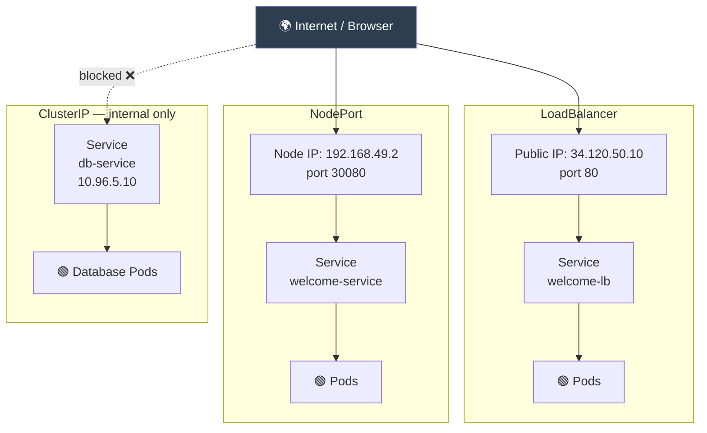

| Type | Who can reach it | Use case |
|---|---|---|
| **ClusterIP** | Only Pods inside the cluster | Databases, internal APIs |
| **NodePort** | Anyone with Node IP + port | Local testing, Minikube |
| **LoadBalancer** | Anyone on the internet | Production apps on cloud |

---

## 8. Deleting Resources

### Delete using the YAML file

```bash
kubectl delete -f deployment.yaml
```

Kubernetes reads the file and deletes whatever is defined inside it — the Deployment, its ReplicaSet, and all its Pods.

### Delete by name

```bash
kubectl delete deployment welcome-deployment
```

Here you tell Kubernetes exactly what to delete:
- resource type: `deployment`
- resource name: `welcome-deployment`

Both do the same thing. Use the YAML file approach when you want to delete everything defined in it at once.

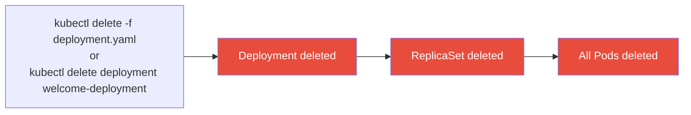

---

## 9. All Commands from This Document

```bash
# Apply the deployment (Pods must run before the Service can route to them)
kubectl apply -f deployment.yaml

# Apply a NodePort Service
kubectl apply -f service-nodeport.yaml

# Apply a LoadBalancer Service
kubectl apply -f service-loadbalancer.yaml

# List all Services
kubectl get svc

# Watch Services live — useful when waiting for LoadBalancer EXTERNAL-IP
kubectl get svc -w

# Full details of a Service (selector, endpoints, port mapping, events)
kubectl describe svc welcome-service

# Open NodePort app in browser via Minikube
minikube service welcome-service

# Delete using the YAML file
kubectl delete -f deployment.yaml
kubectl delete -f service-nodeport.yaml

# Delete by resource type and name
kubectl delete deployment welcome-deployment
kubectl delete svc welcome-service
```

---

## Summary

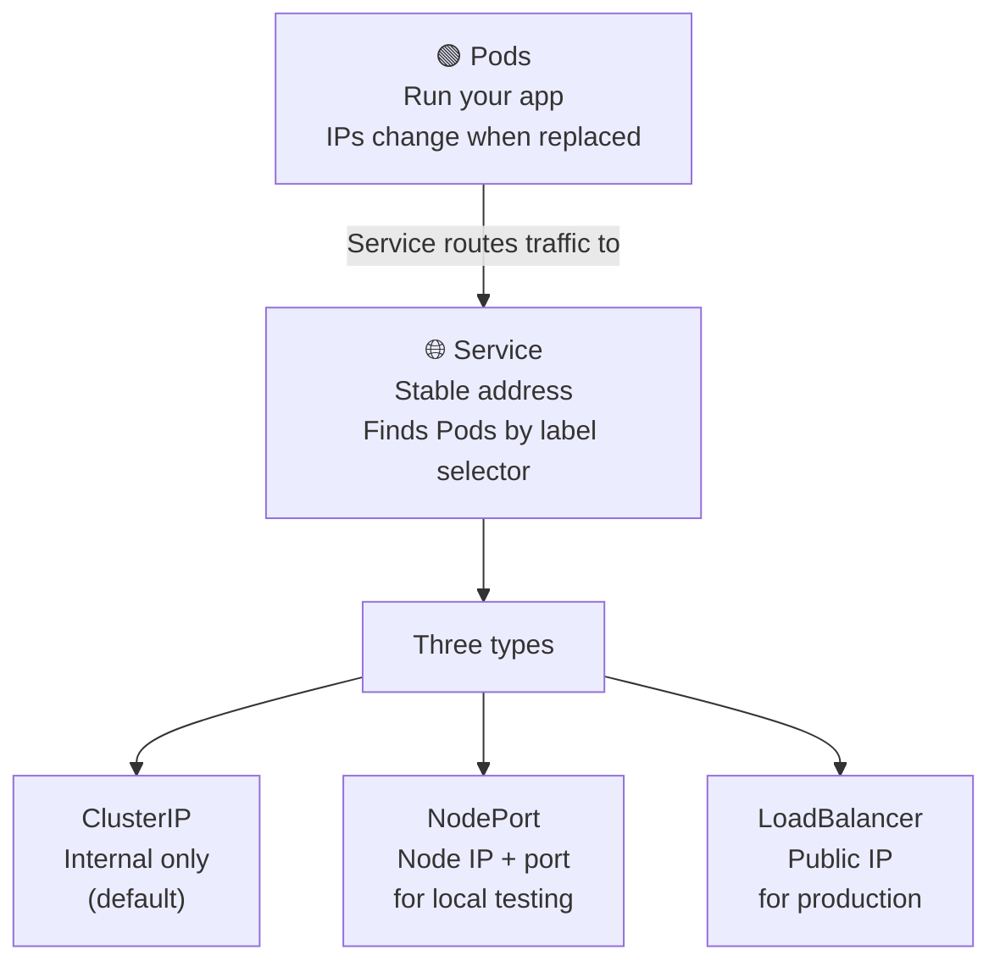

| Concept | One-line summary |
|---|---|
| **Service** | Stable address that routes traffic to the right Pods using a label selector |
| **ClusterIP** | Internal address — only reachable from inside the cluster |
| **NodePort** | Opens a port on the Node — reachable from outside using Node IP + port |
| **LoadBalancer** | Gets a public IP from the cloud — production way to expose an app |
| **selector** | The label the Service uses to find which Pods to send traffic to |
| **port** | The port the Service listens on inside the cluster |
| **targetPort** | The port the container is actually listening on inside the Pod |
| **nodePort** | The port opened on the Node itself (30000–32767) |
