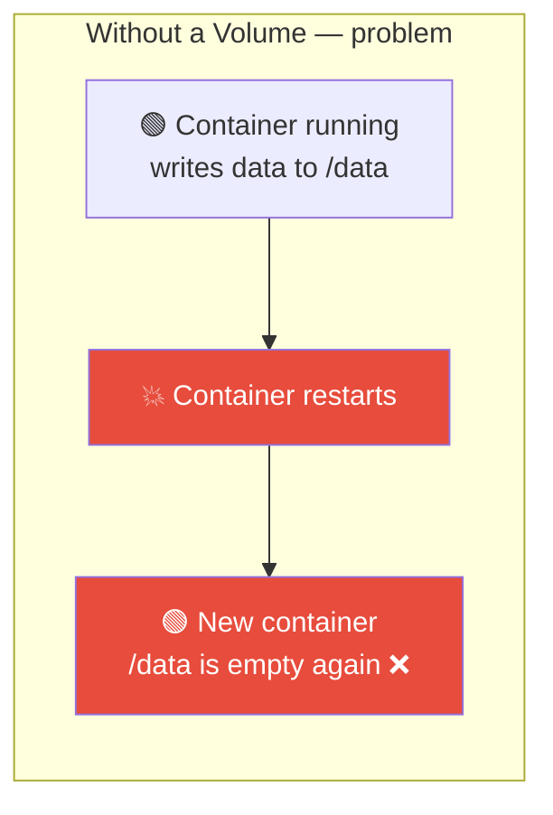
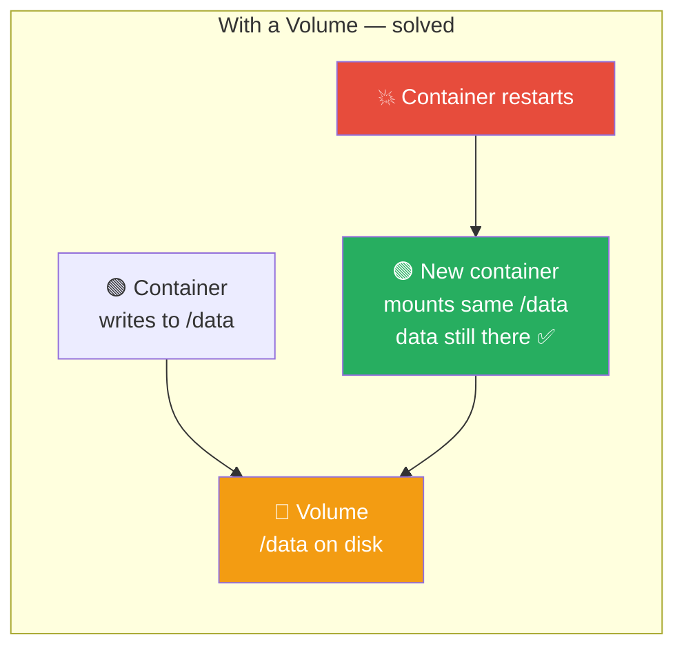
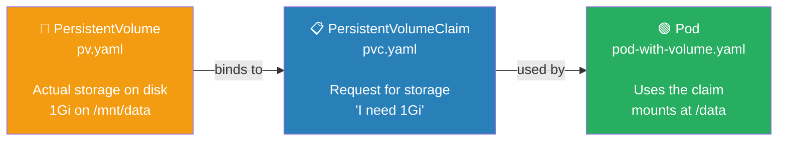
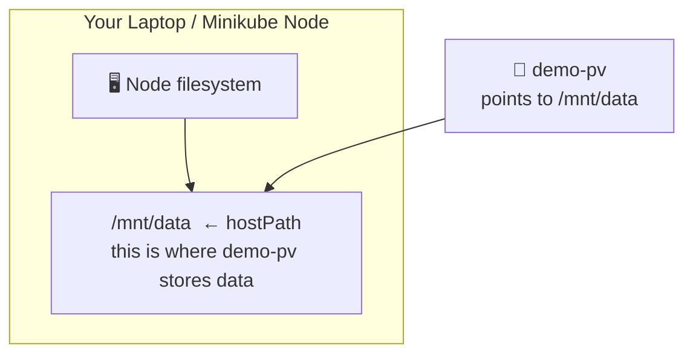
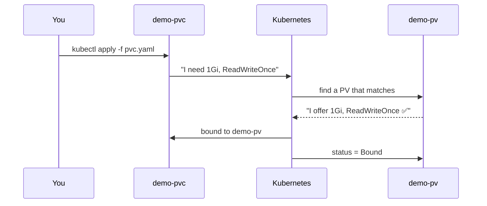
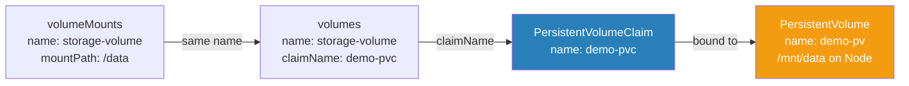
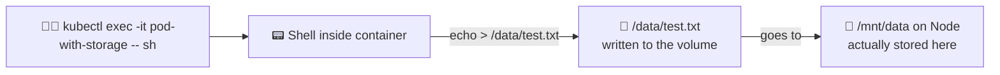
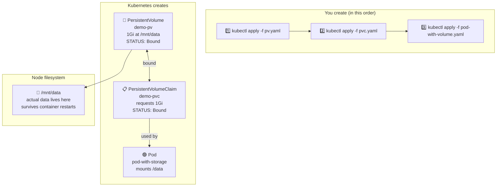
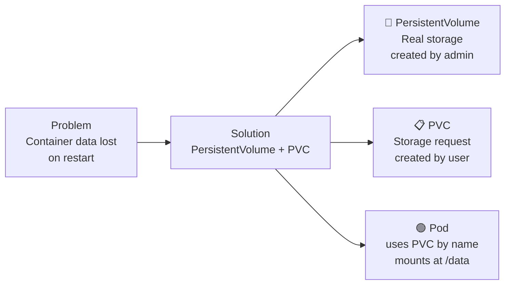

# 06. Volumes — PersistentVolume & PersistentVolumeClaim

> **Series:** Overview → Install → Core Concepts → Deployments → Services → **Volumes** → …

In the previous documents your Pods ran containers but never saved any data. The moment a container restarts, everything inside it is gone. This document explains how to give a Pod permanent storage that survives restarts — using **PersistentVolume** and **PersistentVolumeClaim**.

---

## 1. Why Do We Need Volumes?

By default, a container's filesystem is temporary. When the container stops, all data is lost:



This is a problem for anything that needs to keep data:
- A database that stores records
- An app that writes uploaded files
- Logs that must survive restarts

A **Volume** attaches real storage to a Pod so data is kept even when the container inside restarts:



---

## 2. The Three Objects You Created

You created three files that work together as a chain:



Simple analogy:

| Kubernetes | Real world |
|---|---|
| **PersistentVolume (PV)** | A physical hard drive plugged into a rack |
| **PersistentVolumeClaim (PVC)** | A form you fill out: "I need 1GB of that drive" |
| **Pod using the PVC** | Your app that gets access to that storage |

---

## 3. PersistentVolume — The Actual Storage

A **PersistentVolume** represents a piece of storage that exists in the cluster. It is created by an admin and is independent of any Pod.

### Your pv.yaml explained

```yaml
apiVersion: v1
kind: PersistentVolume
metadata:
  name: demo-pv              # the name of this storage — used when binding to a PVC
spec:
  capacity:
    storage: 1Gi             # how much storage this PV offers
  accessModes:
    - ReadWriteOnce          # only one Node can mount this for reading and writing at a time
  hostPath:
    path: "/mnt/data"        # where on the Node's disk the data is actually stored
```

### What hostPath means

`hostPath` means the data is stored directly on the **Node's filesystem** (your Minikube machine). This is simple and great for learning but not used in production — in production you use cloud storage (AWS EBS, GCP Persistent Disk, etc.).



### accessModes

| Mode | Meaning |
|---|---|
| `ReadWriteOnce` | One Node can read and write — most common for databases |
| `ReadOnlyMany` | Many Nodes can read, no writing |
| `ReadWriteMany` | Many Nodes can read and write — requires special storage like NFS |

Your `demo-pv` uses `ReadWriteOnce` — perfect for a single-node Minikube setup.

---

## 4. PersistentVolumeClaim — The Storage Request

A **PersistentVolumeClaim** is how a Pod asks for storage. The Pod does not talk to the PV directly — it makes a claim, and Kubernetes finds a matching PV and **binds** them together.

### Your pvc.yaml explained

```yaml
apiVersion: v1
kind: PersistentVolumeClaim
metadata:
  name: demo-pvc             # the name — the Pod will reference this name
spec:
  accessModes:
    - ReadWriteOnce          # must match the PV's accessMode
  resources:
    requests:
      storage: 1Gi           # how much storage the Pod needs — must fit within the PV's capacity
```

### How Kubernetes binds PVC to PV



Once bound, `kubectl get pvc` shows:

```
NAME       STATUS   VOLUME    CAPACITY   ACCESS MODES   AGE
demo-pvc   Bound    demo-pv   1Gi        RWO            5s
```

`STATUS: Bound` means the PVC found a matching PV and they are connected.

---

## 5. Pod With Volume — Using the Storage

The Pod does not reference the PV directly. It only references the **PVC by name**, and Kubernetes handles the rest.

### Your pod-with-volume.yaml explained

```yaml
apiVersion: v1
kind: Pod
metadata:
  name: pod-with-storage
spec:
  containers:
  - name: volume-container
    image: busybox                        # a tiny Linux image good for testing
    command: [ "sh", "-c", "sleep 3600" ] # keeps the container running for 1 hour
    volumeMounts:
     - mountPath: "/data"                 # where inside the container the volume appears
       name: storage-volume              # must match the volume name below

  volumes:
    - name: storage-volume               # a name — used to connect volumeMounts to the actual volume
      persistentVolumeClaim:
        claimName: demo-pvc              # which PVC to use — matches metadata.name in pvc.yaml
```

### The connection chain inside the YAML



### What busybox is

`busybox` is a tiny Linux image that contains basic shell commands (`sh`, `ls`, `echo`, `cat`). It has no web server — it is used purely for testing. The `sleep 3600` command keeps the container alive for 1 hour so you can `exec` into it and test the volume.

---

## 6. Commands

### Step 1 — Create the PV

```bash
kubectl apply -f pv.yaml

# Verify it was created
kubectl get pv
```

```
NAME      CAPACITY   ACCESS MODES   RECLAIM POLICY   STATUS      AGE
demo-pv   1Gi        RWO            Retain           Available   3s
```

`STATUS: Available` means the PV exists and is waiting for a claim.

---

### Step 2 — Create the PVC

```bash
kubectl apply -f pvc.yaml

# Verify it bound to the PV
kubectl get pvc
```

```
NAME       STATUS   VOLUME    CAPACITY   ACCESS MODES   AGE
demo-pvc   Bound    demo-pv   1Gi        RWO            3s
```

After this, check the PV again — its status changes to `Bound`:

```bash
kubectl get pv
```

```
NAME      CAPACITY   ACCESS MODES   STATUS   CLAIM              AGE
demo-pv   1Gi        RWO            Bound    default/demo-pvc   10s
```

---

### Step 3 — Create the Pod

```bash
kubectl apply -f pod-with-volume.yaml

kubectl get pods
```

```
NAME               READY   STATUS    RESTARTS   AGE
pod-with-storage   1/1     Running   0          5s
```

---

### Step 4 — Test the Volume

Open a shell inside the container and write a file to `/data`:

```bash
kubectl exec -it pod-with-storage -- sh
```

Inside the shell:

```sh
# write something to the volume
echo "hello from kubernetes" > /data/test.txt

# read it back
cat /data/test.txt
# hello from kubernetes

# exit the shell
exit
```



Now delete the Pod and recreate it — the file will still be there because it is stored on the PV, not inside the container:

```bash
kubectl delete pod pod-with-storage
kubectl apply -f pod-with-volume.yaml
kubectl exec -it pod-with-storage -- sh

cat /data/test.txt
# hello from kubernetes  ← still there ✅
```

---

### Other useful commands

```bash
# Full details of the PV (capacity, status, which PVC it is bound to)
kubectl describe pv demo-pv

# Full details of the PVC (which PV it bound to, events)
kubectl describe pvc demo-pvc

# Delete everything
kubectl delete -f pod-with-volume.yaml
kubectl delete -f pvc.yaml
kubectl delete -f pv.yaml
```

> **Order matters when deleting:** always delete the Pod first, then the PVC, then the PV.

---

## 7. The Full Picture



---

## Summary



| Concept | One-line summary |
|---|---|
| **Volume** | Storage attached to a Pod that outlives the container |
| **PersistentVolume (PV)** | The actual storage — defined by an admin, exists independently of any Pod |
| **PersistentVolumeClaim (PVC)** | A request for storage — Pod asks for what it needs, Kubernetes finds a matching PV |
| **hostPath** | Stores data on the Node's own disk — simple, good for Minikube and learning |
| **ReadWriteOnce** | One Node can mount this volume for reading and writing at a time |
| **Bound** | The PVC successfully found and locked a matching PV |
| **mountPath** | The path inside the container where the volume appears |
| **claimName** | The name of the PVC the Pod wants to use |
